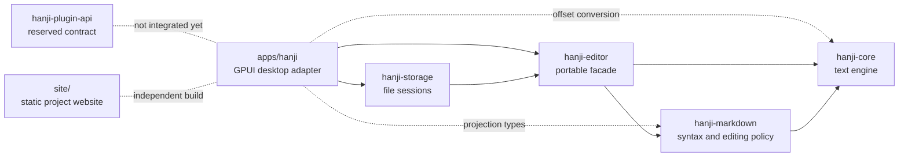

# Architecture

Hanji is a local-first Markdown editor whose durable state is ordinary UTF-8 Markdown. The implementation is split so that text mutation, Markdown policy, persistence, and platform UI can evolve independently.

This directory describes the architecture that exists today. Behavioral semantics live in [`../design/`](../design/README.md), exact public contracts live in [`../reference/`](../reference/README.md), and unimplemented directions live in [`../plans/`](../plans/README.md).

## Belongs Here

- Current component ownership and dependency direction.
- Runtime data flow and state ownership.
- Boundaries between crates, applications, storage, rendering, and platform adapters.
- Architectural invariants enforced by the current implementation.

## Does Not Belong Here

- Product behavior independent of module layout; put it in `docs/design/`.
- Exact current API listings; put them in `docs/reference/`.
- Unimplemented target architecture; put it in `docs/plans/`.
- Historical rationale for a durable choice; put it in `docs/decisions/`.

## System Map



Solid arrows are normal runtime dependencies. Dotted arrows show limited adapter use or future integration. The desktop app may consume projection types and offset helpers, but document mutation still passes through `hanji-editor` via `DocumentSession`.

## Architectural Invariants

- Markdown source is the only durable document model.
- `hanji-core` is syntax-agnostic and platform-independent.
- Markdown-aware behavior has one implementation in `hanji-markdown`.
- Platform frontends mutate documents only through `hanji-editor`.
- Persistence observes editor updates; it does not define editing policy.
- Projection and layout are derived state and can be rebuilt from source.
- Native UI, browser UI, clipboard, file dialogs, and pixels stay outside the portable engine.

## Runtime Paths

Opening a file:

```text
filesystem -> hanji-storage::DocumentSession -> hanji-editor::Editor -> GPUI window
```

Editing source:

```text
platform event -> TextInput or Command -> DocumentSession -> Editor
               -> Markdown policy and core transaction -> Update -> repaint/dirty state
```

Rendering:

```text
Editor::projection -> MarkdownProjection -> GPUI measurement -> prepaint -> paint
```

Saving:

```text
Editor::source -> DocumentSession -> temporary file -> fsync -> atomic rename
```

## Contents

- [Crate Boundaries](crate-boundaries.md): dependency direction and ownership rules.
- [Editing Runtime](editing-runtime.md): how input, commands, transactions, history, and updates flow.
- [Projection and Rendering](rendering.md): the boundary between source projection and GPUI pixels.
- [Persistence](persistence.md): document sessions, dirty tracking, and atomic file writes.
- [Platform Adapters](platform-adapters.md): native responsibilities and the planned WebAssembly boundary.

## Maintenance Rule

Architecture documents describe the current repository. A code change that moves ownership, adds a dependency, or opens a new mutation path must update the relevant document in the same change. Future work should be recorded under `docs/plans/` until it is implemented.
