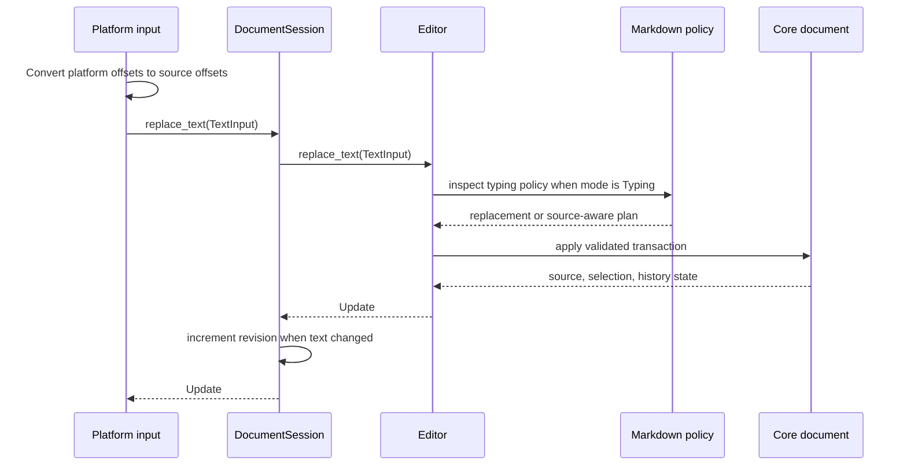

# Editing Runtime

Status: Current

This document describes the live mutation path. The exact facade surface is listed in [Editor API](../reference/editor-api.md); Markdown behavior is defined in [Editing Policy](../design/editing-policy.md).

## State Ownership

| State | Owner |
| --- | --- |
| UTF-8 source, normalized core selection, undo/redo history | `hanji-core::Document` |
| Directional public selection and policy coordination | `hanji-editor::Editor` |
| Path, saved source, dirty state, session revision | `hanji-storage::DocumentSession` |
| IME marked range, focus, viewport, layout snapshots, drag state | `apps/hanji` |

The same information is not freely mutable in multiple layers. Higher layers either translate platform state into an editor request or derive their state from an editor result.

## Mutation Surface

Every frontend mutation uses one of three methods:

```rust
editor.set_selection(selection)?;
editor.replace_text(input)?;
editor.execute(command)?;
```

- `set_selection` changes the directional source selection without creating history.
- `replace_text` handles inserted or replacement text and runs policy according to its input mode.
- `execute` handles logical intent such as deletion, newline, formatting, indentation, task toggling, undo, and redo.

There is intentionally no raw transaction entry point and no text-insertion command. That prevents an adapter from skipping Markdown typing policy.

## Text Input Flow



`Typing` may complete, wrap, skip, or remove Markdown markers. `Literal` preserves supplied source and is used for paste and IME composition updates.

## Command Flow

Commands describe intent, not keys. A keyboard shortcut, menu item, or future browser toolbar sends the same `Command`.

The editor either delegates a syntax-agnostic operation to `hanji-core`, asks `hanji-markdown` to plan a syntax-aware edit, or coordinates both. Undo and redo are commands so history changes use the same observable outcome path.

## Update Semantics

Every successful operation returns `Update` with three independent observations:

- `text_changed`: source bytes changed.
- `selection_changed`: anchor or head changed.
- `history_changed`: undo or redo availability changed.

An operation can succeed without changing anything. Frontends should use `Update` to decide whether to repaint, synchronize native input state, refresh undo controls, or persist source instead of comparing complete documents.

`DocumentSession` increments its monotonic revision only when `text_changed` is true. Dirty state is stricter: current source is compared with the last successfully saved source, so undoing back to the saved text clears dirty state.

## Query and Projection Flow

Read-only queries do not pass through storage. The app obtains `&Editor` from the session and reads source, selection, line information, navigation boundaries, history availability, or a borrowed Markdown projection.

Projection never mutates the document. It is disposable derived data whose ranges point back into the current UTF-8 source.

## Error Boundaries

The facade maps lower-layer errors into editor-owned variants:

- invalid source range;
- invalid text boundary;
- invalid selection;
- internal invariant failure.

Storage keeps I/O errors separate from editor errors. Platform-specific strings, `JsValue`, DOM exceptions, and GPUI event types do not enter the portable error contract.
